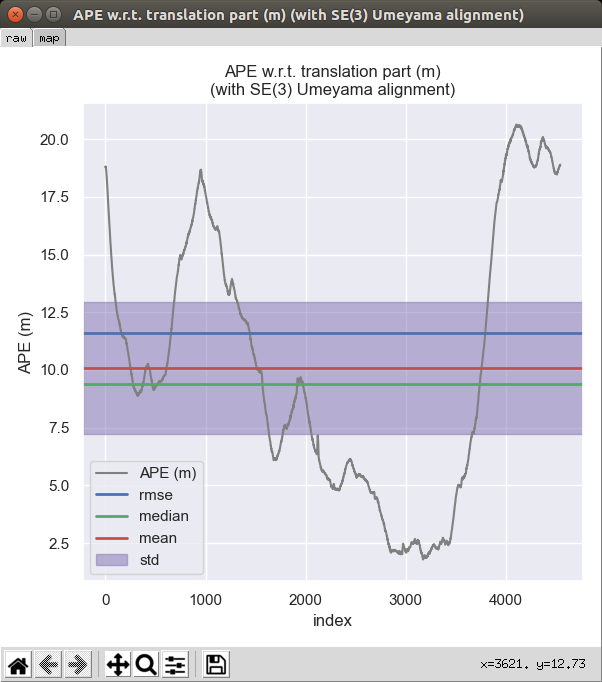
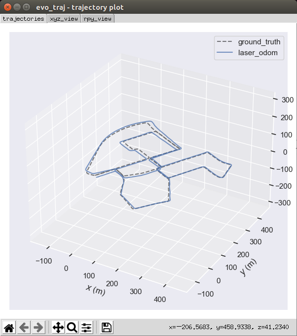
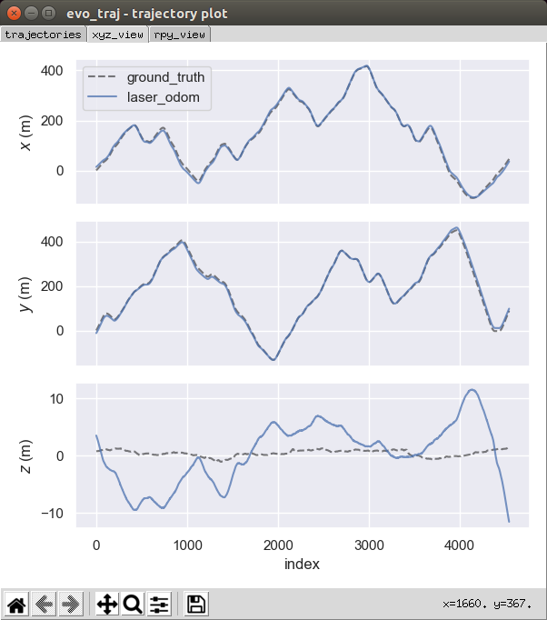
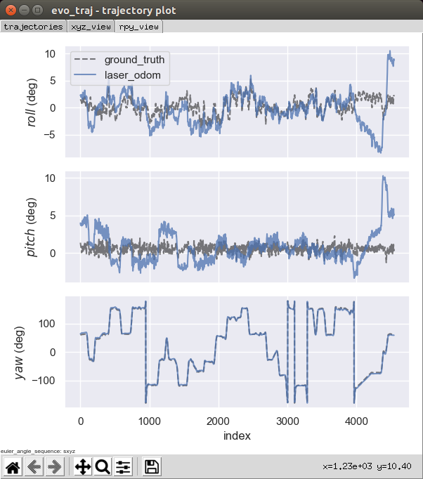

# Sensor Fusion: Lidar Odometry

Written partly by Wayne Yu / 余千海

See `src/lidar_localization/src/models/registration/my_ndt_registration.cpp`

## Startup

```bash
cd /workspace/assignments/01-lidar-odometry
# build
catkin config --install && catkin build
# set up session:
source install/setup.bash
# launch:
roslaunch lidar_localization front_end.launch
```


Then open another terminal:
```bash
cd /workspace/data/kitti
rosbag play kitti_lidar_only_2011_10_03_drive_0027_synced.bag
```

Open a third terminal to use `evo` for verification:
```bash
cd /workspace/assignments/01-lidar-odometry/src/lidar_localization/slam_data/trajectory
# Compare the trajectory
evo_traj kitti laser_odom.txt --ref ground_truth.txt -p -a
# Calculation of absolute pose error
evo_ape kitti laser_odom.txt ground_truth.txt -p -a
# Calculation of relative pose error
evo_rpe kitti laser_odom.txt ground_truth.txt -p -a
```


## Summary

Too drift in the last half   ;(

But it works.

I transfer the code from github repo [`koide3/ndt_omp`](https://github.com/koide3/ndt_omp), it inherit from pcl ndt library but 
make some optimization be muti threaded, it says it can be up to 10 times faster than the original version in pcl, maybe.

But I don't think it has a better result than original one.


## My Screenshot


Evo verification:







