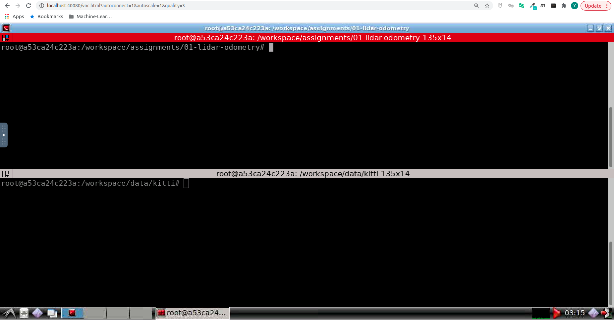
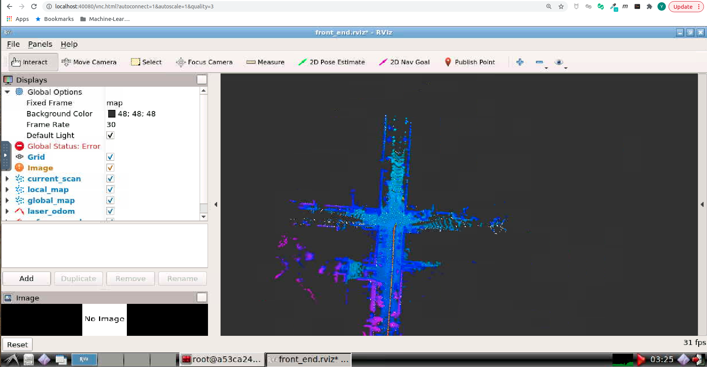
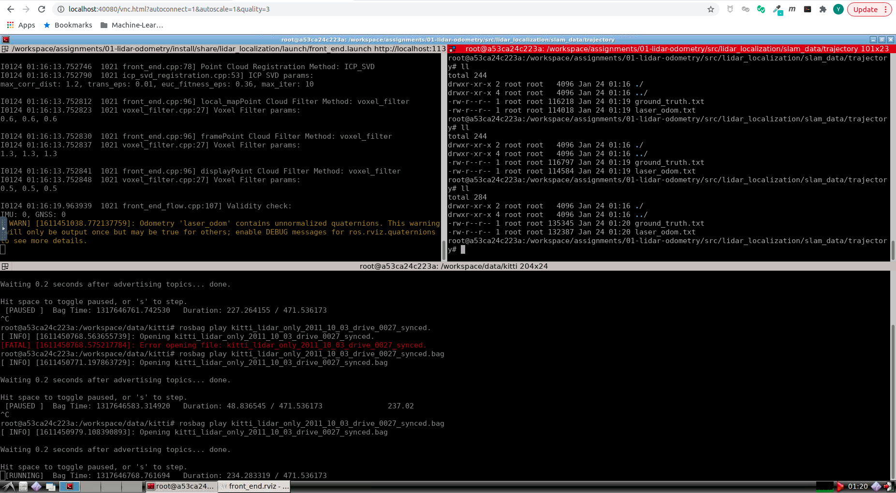

# 激光前端里程计算法


## Getting Started

启动Docker后, 打开浏览器, 进入Web Workspace. 启动Terminator, 将两个Shell的工作目录切换如下:



在**上侧**的Shell中, 输入如下命令, **编译catkin_workspace**

```bash
cd /workspace/assignments/01-lidar-odometry
# build
catkin config --install && catkin build
```

然后**启动解决方案**

```bash
# set up session:
source install/setup.bash
# launch:
roslaunch lidar_localization front_end.launch
```

在**下侧**的Shell中, 输入如下命令, **Play KITTI ROS Bag**. 两个数据集均可用于完成课程, 对代码功能的运行没有任何影响, 区别在于第一个有Camera信息

```bash
cd /workspace/data/kitti
# play ROS bag, full KITTI:
rosbag play kitti_2011_10_03_drive_0027_synced.bag
# play ROS bag, lidar-only KITTI:
rosbag play kitti_lidar_only_2011_10_03_drive_0027_synced.bag
```

成功后, 可以看到如下的RViz界面:



```bash
cd /workspace/assignments/01-lidar-odometry/src/lidar_localization/slam_data/trajectory
```



该目录下会输出:

* 作为Ground Truth的RTK轨迹估计, ground_truth.txt
* Lidar Frontend轨迹估计, laser_odom.txt
